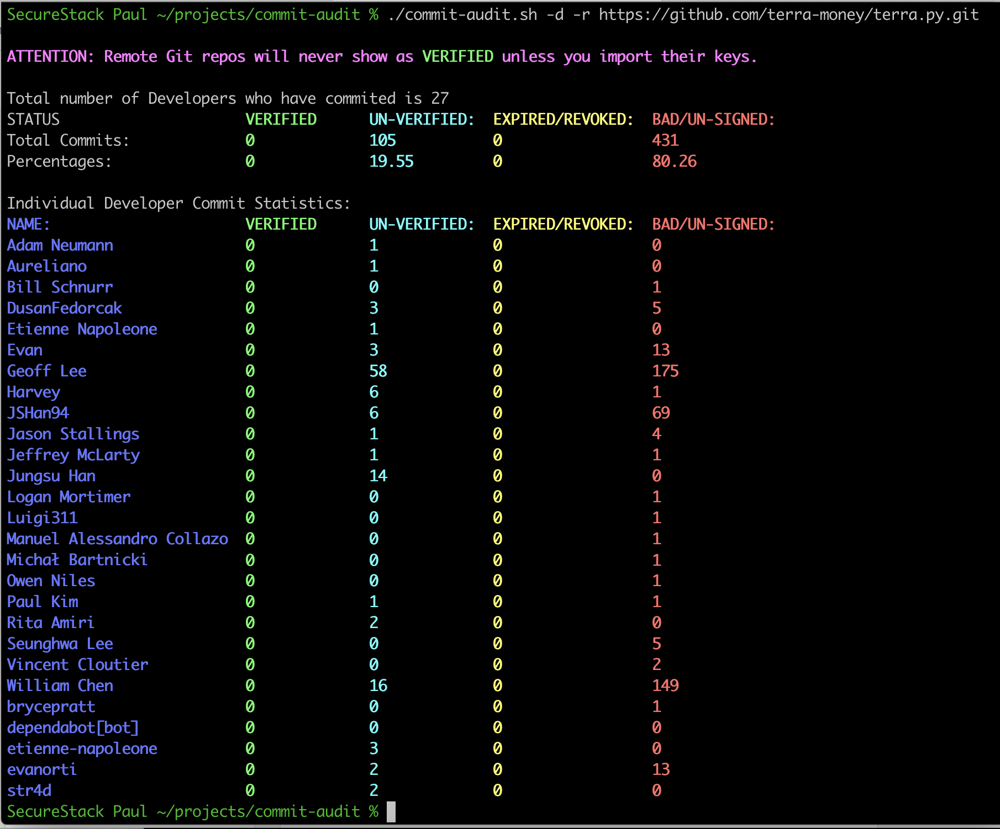
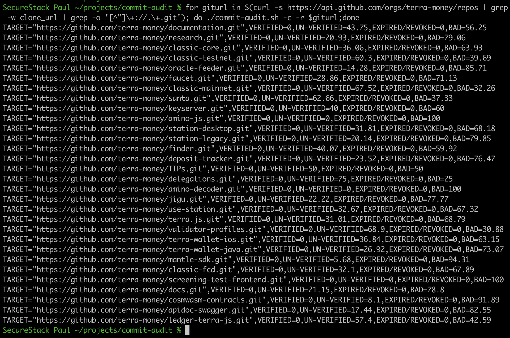

# commit-audit
This bash script will "audit" the status of git commit signatures:

* Works on local or remote git repositories
* Shows statistics for the whole repo by default
* Generate simple CSV report on remote repos
* Optionally will show statistics for all individual contributors

## Background

By default git uses your email address as the way to track who created a commit.  This is trivially easy to fake and all you have to do is use a different email and it will show up as that user, not you.  This presents a way for bad guys to attack the credibility of git commits. The number of attacks on source code and the software supply chain are growing exponentially, so anything you can do to limit these attacks is beneficial.  You can read a humorous story about how someone impersonated Linus Torvalds [here](https://dev.to/martiliones/how-i-got-linus-torvalds-in-my-contributors-on-github-3k4g).

A great way to counter this type of attack is to use signed commits.  Signing your commits is simple and uses PKI (public key infrastructure) to store a public key with the source code management (SCM) provider like GitHub or GitLab.  You keep the private key locally and when you commit the two are checked and if they match, you can commit your changes.  Here's a great explanation of how it [works](https://www.freecodecamp.org/news/what-is-commit-signing-in-git/) and how to setup GPG signing for your commits.

I needed a tool that I could use to audit large numbers of git repositories quickly, so I wrote commit-audit.sh.  Enjoy!

## Usage Documentation

Get help

```
commit-audit.sh -h
```

Run in local directory that has git repo:

```
commit-audit.sh
```

Audit repo and get statistics on individual developers:

```
commit-audit.sh -d
```

Audit a remote repository:

```
commit-audit.sh -r https://github.com/facebook/react.git
```

Audit a remote repository and get developer stats:

```
commit-audit.sh -d -r https://github.com/facebook/react.git
```

Get a report in CSV format.  This is great for mass scanning git repos:

```
commit-audit.sh -c -r https://github.com/facebook/react.git
```

## What the output looks like

### Developer statistics on remote repo:


### Generate CSV report on list of repos:


## Sponsors 
Sponsored with 💜  by

<a href="https://securestack.com" target=”_blank” rel="noopener noreferrer"><center></center></a>


