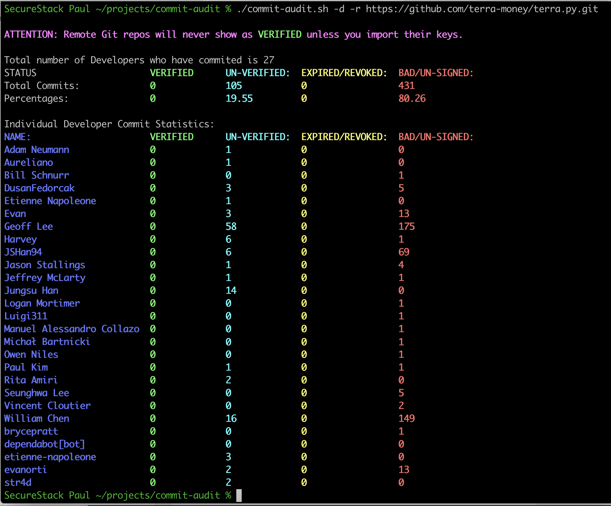

# commit-audit
This bash script will "audit" the status of git commit signatures:

* Works on local or remote git repositories
* Shows statistics for the whole repo by default
* Generate simple CSV report on remote repos
* Optionally will show statistics for all individual contributors

## Usage Documentation

Get help

```
commit-audit.sh -h
```

Run in local directory that has git repo:

```
commit-audit.sh
```

Audit repo and get statistics on individual developers:

```
commit-audit.sh -d
```

Audit a remote repository:

```
commit-audit.sh -r https://github.com/facebook/react.git
```

Audit a remote repository and get developer stats:

```
commit-audit.sh -d -r https://github.com/facebook/react.git
```

Get a report in CSV format.  This is great for mass scanning git repos:

```
commit-audit.sh -c -r https://github.com/facebook/react.git
```

## What the output looks like

### Developer statistics on remote repo:


### Generate CSV repot on list of repos:

## Sponsors 
Sponsored with 💜  by

<a href="https://securestack.com" target=”_blank” rel="noopener noreferrer"><center></center></a>


